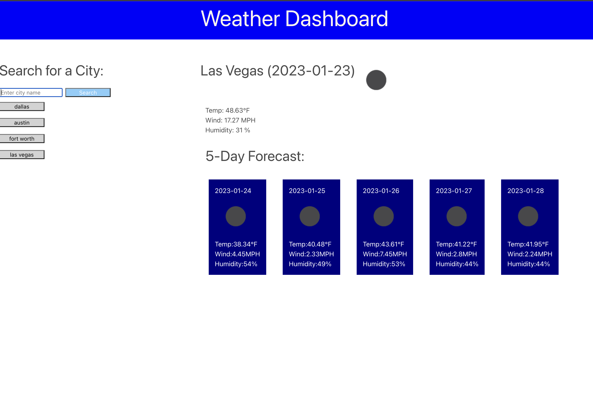

# Weather Dashboard

## Description

I was wanting to make a weather dashboard so that I could input a city to view the current weather as well as see a 5 day forecast to be able to plan my events accordingly.  The data that I was wanting to included in the display incudes the date, an icon representing the weather conditions, temperature, humidity, and the wind speed.  I was also wanting to add my previously searched cities to a list that I could click on and find the weather again.  While working on this project I was able to learn more about API calls and being able to parse the data.

The following is a link to the website [Weather Dashboard site] (https://arms-like-trees.github.io/Challenge-6-Weather-Dashboard/)

## Finished product appearances

The following shows the site with different cities listed and saved by pulling and getting from local storage.

